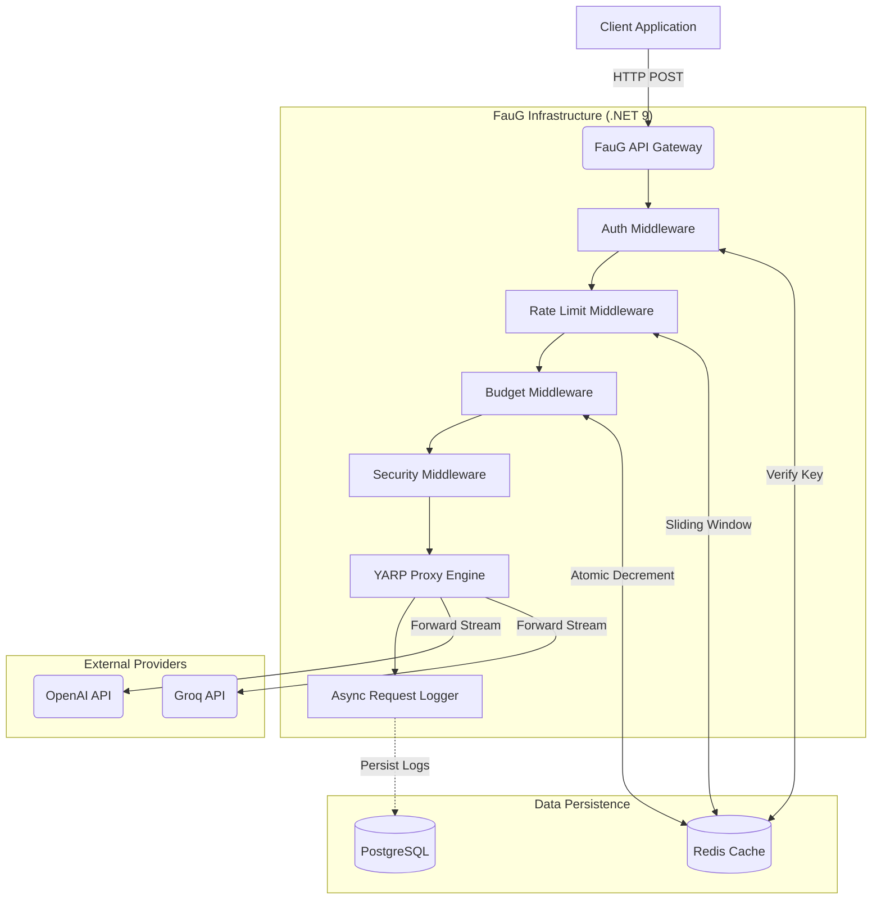
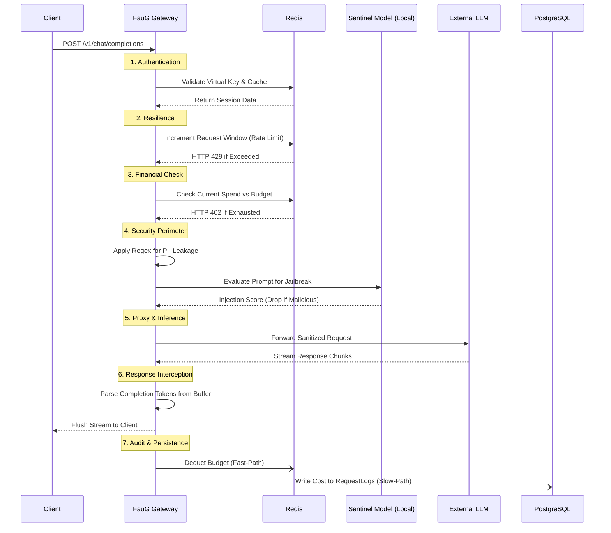

FauG, which is derived from the Hindi word for "Soldier," stands for a resolute guardian. Faugi is the front-line defender in the quickly changing field of autonomous AI agents, making sure that every prompt is secure, every response is validated, and every dollar of the budget is tracked.

## 1. Core Architectural Pillars
- **Zero-Trust Governance**: Every request is authenticated via Virtual Keys with strict budget and policy enforcement before inference.
- **The "Cursor" Routing Model**: A single unified endpoint abstracting multiple providers (OpenAI, Groq).
- **Multi-Layered Defense**: Sequential security filters for input prompts leveraging local Machine Learning models.
- **Real-Time Observability**: Synchronous Redis tracking combined with asynchronous PostgreSQL persistence for zero-latency auditing.

## 2. High-Level System Architecture
The following diagram illustrates the deployment topology and network flow between the client, the API Gateway, and the external dependencies.

## 3. The Life Cycle of a Prompt
The gateway processes every request through a sequential middleware pipeline. Any stage can short-circuit the request if a violation is detected, preventing the payload from reaching the upstream provider.

## 4. Optimization Strategy 
To ensure minimal latency overhead against provider streaming, the Gateway utilizes aggressive caching mechanisms:

### A. Virtual Key Validation (Auth)
*   **Cache Strategy**: `Key:{Hash}` resolves to `{UserId, OrgId, Scopes}`.
*   **TTL**: 5 minutes (Sliding expiration).
*   **Result**: Eliminates relational database lookups on high-frequency token generation requests.

### B. Real-Time Budgeting (The High-Speed Counter)
*   **Cache Strategy**: Use Redis `DECR` (Atomic Decrement) for real-time budget enforcement.
*   **Persistence**: Asynchronous background workers flush usage from Redis to PostgreSQL.
*   **Result**: Prevents "double-spend" financial attacks and database locking during high concurrency.

## 5. Middleware Pipeline Order
The `.NET` middleware sequence is designed to maximize performance by dropping invalid traffic as early as possible.
1. `AuthMiddleware`: Validates identity.
2. `RateLimitingMiddleware`: Protects system health (mathematically limits RPM).
3. `BudgetMiddleware`: Protects project finances (limits total monetary spend).
4. `SecurityMiddleware`: Protects data (executes the heavy ONNX ML scoring).
5. `YARP Reverse Proxy`: Manages network egress and chunk buffering.
