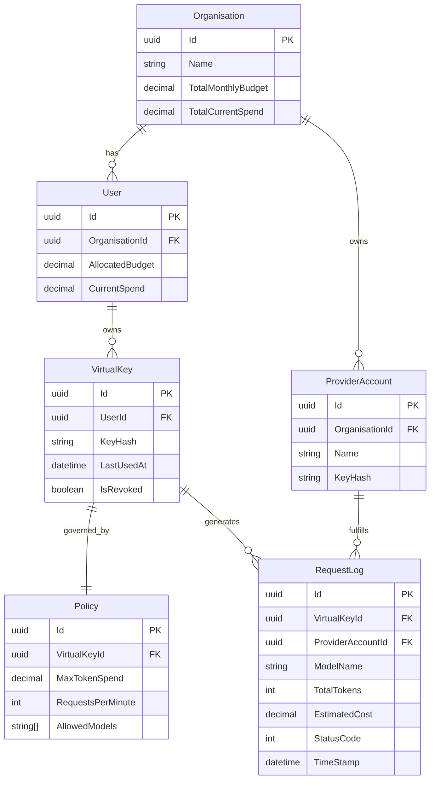

# Project FauG: System Architecture

## 1. Core Architectural Pillars
- **Zero-Trust Governance**: Every request is authenticated via Virtual Keys with strict budget and policy enforcement.
- **The "Cursor" Routing Model**: A single endpoint abstracting multiple providers (OpenAI, Groq).
- **Multi-Layered Defense**: Sequential security filters for both input (prompts) and output (responses).
- **Observability First**: Real-time token tracking and cost attribution.

## 2. The Life Cycle of a Prompt (Internal Workflow)
The gateway processes every request through a **Sequential Middleware Pipeline**. Any stage can "short-circuit" the request if a violation is detected.

1.  **Ingress (The Gate)**:
    -   Request hits the API endpoint (e.g., `POST /v1/chat/completions`).
    -   **AuthMiddleware**: Validate Bearer token (Virtual Key) against Redis cache.

2.  **Financial Gate (Hard Check)**:
    -   **BudgetMiddleware**: Atomic check of `CurrentSpend < Budget` via Redis.
    -   If failed: Return `402 Payment Required`.

3.  **Input Shielding**:
    -   **Injection Scan**: Detect jailbreak patterns to prevent prompt injection.
    -   **PII Masking**: Redact sensitive data (emails, keys) from the prompt.
    -   **Topic Filtering**: Block prohibited intents.

4.  **Dynamic Routing**:
    -   Select the optimal `ProviderAccount` based on policy or requested model.
    -   Inject required system instructions (Instruction Following).

5.  **Inference Execution**:
    -   Proxy the request to the upstream LLM (OpenAI/Groq) via YARP.
    -   **Streaming**: Handle Server-Sent Events (SSE) for real-time responses.

6.  **Output Shielding**:
    -   **Leak Check**: Scan the response stream for accidental credential leaks.
    -   **Quality Check**: Validate JSON structure if required.

7.  **Egress & Audit**:
    -   Stream the sanitized response to the client.
    -   **Async Logging**: Update usage logs and spend tables without blocking the user.

## 3. Optimization Strategy (Redis & Caching)
To ensure minimal latency (<10ms overhead), we aggressively cache hot data:

### A. Virtual Key Validation (Auth)
*   **Cache Key**: `Key:{Hash}` -> `{UserId, OrgId, Scopes}`
*   **TTL**: 5 minutes (Sliding expiration)
*   **Benefit**: Eliminates DB lookups on every single API call.

### B. Real-Time Budgeting (The High-Speed Counter)
*   **Mechanism**: Use Redis `DECR` (Atomic Decrement) for real-time budget enforcement.
*   **Sync**: Async background worker ("Write-Behind") flushes usage from Redis to PostgreSQL every 1 minute.
*   **Benefit**: Prevents "double-spend" attacks and DB locking during high concurrency.

### C. Policy & Routing Rules
*   **Cache Key**: `OrgPolicy:{OrgId}` -> JSON config (Allowed Models, Rate Limits)
*   **TTL**: 1 hour (Invalidate on update)

## 4. Database Schema (ER Diagram)
Below is the data model derived from the specifications:

## 5. Technical Stack
| Component | Technology | Why? |
|-----------|-----------|------|
| **Backend API** | .NET 9 ASP.NET Core | High throughput, type safety, outstanding JSON performance. |
| **Proxy Engine** | YARP | Robust reverse proxy library for HTTP forwarding. |
| **Database** | PostgreSQL | Reliability, JSON support, relational integrity. |
| **Cache** | Redis | sub-ms latency for counters and session state. |
| **Frontend** | Next.js 15 (App Router) | Modern, server-side rendering for dashboards. |
